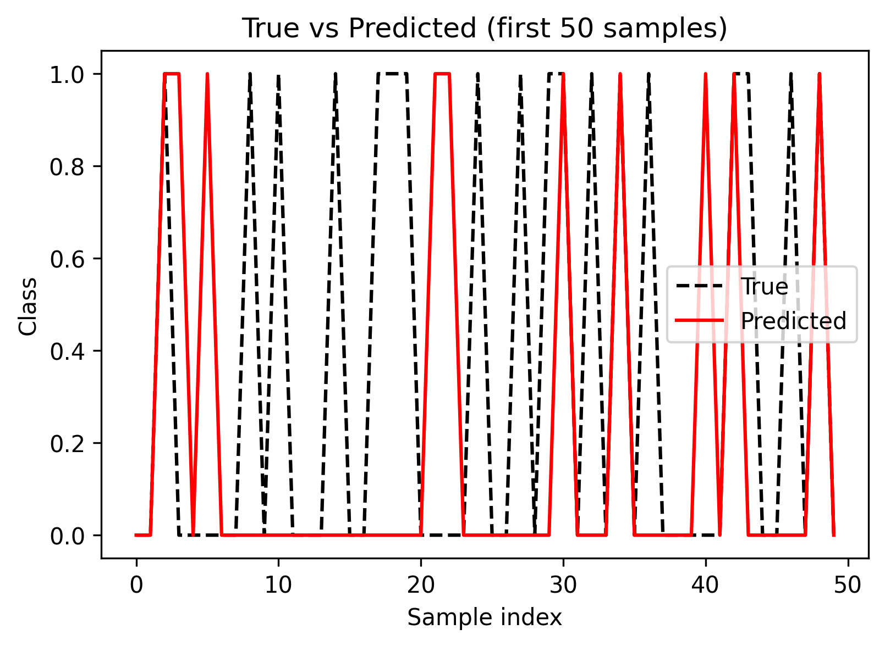

# nosebleed-predictor

This project is a machine learning application that predicts the likelihood of a nosebleed based on patient data. It uses a trained classification model to provide predictions for new input cases.

The motivation behind this project comes from personal experience—I have suffered from nosebleeds, which inspired me to explore the factors that might contribute to them and develop a predictive tool.

**Causes of Nosebleeds:**
Nosebleeds, also known as epistaxis, can occur due to a variety of reasons, including:

* Dry air or low humidity, which can dry out nasal membranes.
* Nose picking or trauma to the nose.
* Allergies, colds, or sinus infections.
* High blood pressure or blood disorders.
* Use of medications such as blood thinners.

For more detailed information, see:

* [Mayo Clinic – Nosebleeds](https://www.mayoclinic.org/diseases-conditions/nosebleeds/symptoms-causes/syc-20351843)
* [NIH – Epistaxis](https://www.ncbi.nlm.nih.gov/books/NBK537041/)

**Datasets and Research References:**

* This project uses a structured dataset compiled from publicly available health research studies on epistaxis.
* Additional datasets for epistaxis can be found via:

  * [Kaggle – Health Data](https://www.kaggle.com/datasets)
  * [UCI Machine Learning Repository](https://archive.ics.uci.edu/ml/index.php)

**Methodology:**

The model uses patient data features, such as medical history, environmental factors, and personal habits, to train a classification algorithm that predicts the likelihood of a nosebleed. Data preprocessing includes handling missing values and encoding categorical variables. Once trained, the model evaluates new patient inputs to provide a probability score indicating the risk of experiencing a nosebleed.

**Results:**

    

**Nosebleed Illustration ⵄ:**

    

